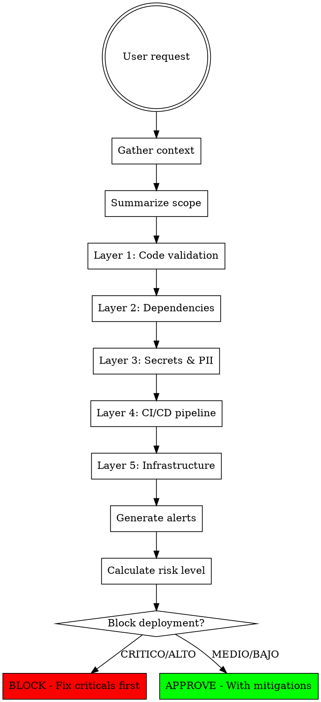

# Cyhber Deploy

## Overview

Systematic DevSecOps review methodology enforcing 5-layer analysis with standardized severity-tagged alerts.

**Purpose:** Ensure comprehensive, structured security review - not ad-hoc vulnerability detection.

## When to Use

**Trigger on:**
- Deploy preparation (staging/production)
- CI/CD changes (workflows, pipelines, build scripts)
- IaC modifications (Terraform, K8s, Docker, cloud config)
- Auth/authz/session handling code
- Secret management changes
- Security review requests
- Suspicious patterns (injection, exposed secrets, overprivileged access)

**Also trigger when user mentions:**
- GitHub Actions, GitLab CI, Jenkins, CircleCI
- AWS, GCP, Azure cloud resources
- Docker, Kubernetes, Helm
- SQL queries, database access
- API keys, tokens, certificates
- Environment variables, config files

## Systematic 5-Layer Review

**ALWAYS follow this order** - don't skip layers based on request scope:



## Context Gathering

Ask if missing:
- **Languages/frameworks:** Node.js, Python, Go, Java, etc.
- **App type:** API, frontend, microservices, monolith
- **Environments:** dev, staging, production
- **Deploy platform:** AWS, GCP, Azure, on-premise, Vercel, Railway
- **Related files:** CI/CD configs, IaC, environment configs

## Standardized Alert Format

**Every security issue MUST use this table:**

| Campo | Valor |
|-------|-------|
| **Severidad** | 🔴 CRITICO \| 🟠 ALTO \| 🟡 MEDIO \| 🟢 BAJO |
| **ID** | CD-SEC-XXX (sequential) |
| **Componente** | file.js:line or resource name |
| **Descripción** | What + why it's a risk |
| **Evidencia** | Code snippet or config excerpt |
| **Remediación** | Specific fix steps |

**Severity levels:**
- 🔴 **CRITICO:** Immediate exploitation possible (injection, hardcoded secrets, public DB)
- 🟠 **ALTO:** Exploitation likely with recon (weak auth, missing authz, exposed admin)
- 🟡 **MEDIO:** Requires chained exploits (verbose errors, missing headers, old deps)
- 🟢 **BAJO:** Defense-in-depth improvements (logging gaps, config hardening)

## Layer 1: Code Validation

### Input Validation
Check ALL user-controlled inputs:
- Type, size, format validation
- Whitelist over blacklist
- Reject vs sanitize (prefer reject)

### Injection Patterns
```javascript
// ❌ SQL Injection
db.query(`SELECT * FROM users WHERE id = ${req.body.id}`)

// ❌ Command Injection  
exec(`ping ${userInput}`)

// ❌ NoSQL Injection
db.find({ user: req.body.user })

// ✅ Parameterized queries
db.query('SELECT * FROM users WHERE id = ?', [req.body.id])
```

### Auth/Authz
- Endpoints require authentication?
- Authorization checks present (not just authn)?
- IDOR vulnerabilities (user A access user B data)?
- Session management secure (httpOnly, secure, sameSite)?

## Layer 2: Dependencies

**Check:**
- Outdated packages (>2 years old)
- Known CVEs (check npm audit, pip-audit, Snyk)
- Unmaintained libraries
- Transitive dependency surprises

**Tools to recommend:**
- SAST: Semgrep, CodeQL, Snyk Code
- SCA: Dependabot, Renovate, npm audit
- Secrets: TruffleHog, GitGuardian, git-secrets

## Layer 3: Secrets & PII

### Secret Patterns
See @secret-patterns.md for full regex list.

**Common patterns:**
- AWS: `AKIA[0-9A-Z]{16}`
- GitHub: `ghp_[a-zA-Z0-9]{36}`
- Private keys: `-----BEGIN.*PRIVATE KEY-----`
- Generic API keys: `api[_-]?key.*['"][a-zA-Z0-9]{20,}['"]`

**🔴 CRITICO when:**
- Hardcoded in source
- Logged to stdout/files
- Committed to git history
- Exposed in error messages

**Secure handling:**
- Move to Secrets Manager / Vault / Key Vault
- Env vars with restrictive permissions
- `.env.example` templates (no real values)
- Auto-rotation policies

### PII Detection
Flag unprotected handling of:
- Names, emails, phone numbers
- Financial, health, govt IDs
- Children's data
- IP addresses, geolocation

**Recommend:**
- Minimize collection
- Encrypt at rest + transit
- Retention policies
- Anonymization where possible

## Layer 4: CI/CD Pipeline

### Pre-Deploy Checklist
- [ ] Unit + integration tests
- [ ] SAST scan
- [ ] SCA scan
- [ ] Secret scan
- [ ] Linting + formatting
- [ ] Build success

### Pipeline Hardening
```yaml
# ✅ GitHub Actions best practices
permissions:
  contents: read        # Minimal permissions
  pull-requests: write

jobs:
  deploy-prod:
    if: github.ref == 'refs/heads/main'  # Branch restriction
    environment:
      name: production
      url: https://app.example.com
    needs: [test, security-scan]  # Dependencies
```

**Check for:**
- Deploys restricted to protected branches
- Manual approval for production
- Secrets not echoed to logs
- Minimal runner permissions
- Rollback plan exists

## Layer 5: Infrastructure

### Exposure Checks
```hcl
# ❌ Database publicly accessible
resource "aws_db_instance" "db" {
  publicly_accessible = true
}

# ❌ Overly permissive security group
ingress {
  cidr_blocks = ["0.0.0.0/0"]
  from_port   = 0
  to_port     = 65535
}
```

**Review:**
- Public vs private subnets
- Security groups / firewalls (least privilege)
- Unused ports exposed
- Internal services require auth

### IAM / RBAC
```json
// ❌ Admin wildcard
{"Effect": "Allow", "Action": "*", "Resource": "*"}

// ✅ Specific permissions
{
  "Effect": "Allow",
  "Action": ["s3:GetObject", "s3:PutObject"],
  "Resource": "arn:aws:s3:::bucket-name/*"
}
```

**Apply least privilege principle.**

### Transport & Encryption
- [ ] TLS 1.2+ on public endpoints
- [ ] Valid certificates (auto-renew)
- [ ] HSTS enabled
- [ ] Encryption at rest for sensitive data
- [ ] VPN/tunnels for admin access

## Proactive Scope Expansion

**Even if user only asks about X, review related files when available:**

User asks about...  | Also check...
--------------------|----------------
Auth endpoint       | Session config, token generation, password reset
CI/CD workflow      | Secrets management, branch protection, runner security
Database config     | Connection strings, backup encryption, access logs
API route           | Input validation, rate limiting, error responses
Container image     | Base image CVEs, exposed ports, secret mounts

**Make scope expansion explicit:**
> "Beyond the auth endpoint, I reviewed related session configuration (found issue Y)."

## Red Flags - STOP

These thoughts mean rationalization:
- "Internal tool, lower risk"
- "Emergency, fix later"
- "Senior approved, must be safe"
- "Tests passing = secure"
- "Quick change, not security-related"
- "13th review today, looks fine"
- "Just frontend, no backend/infra relevant"
- "Read-only component, no input validation needed"

**All of these = run full 5-layer review anyway.**

## Common Mistakes

| Mistake | Reality |
|---------|---------|
| "Internal API, no validation needed" | Internal = lateral movement target. Validate everything. |
| "Will fix secrets after deploy" | Never happens. Fix now or block deploy. |
| "One-off deploy, skip CI" | One-offs cause most incidents. Full checks always. |
| "Tests passed = secure" | Tests check functionality, not security. Separate concerns. |
| "Senior reviewed, I trust them" | Humans miss things under pressure. Systematic review always. |
| "Alert fatigue, ignoring MEDIUM" | MEDIUM today = CRITICAL tomorrow. Document all findings. |

## Final Risk Assessment

After generating all alerts, provide:

```
┌─────────────────────────────────────────────┐
│ 🔒 ESTADO DE SEGURIDAD                      │
├─────────────────────────────────────────────┤
│ Nivel de riesgo:  [🔴 CRITICO / 🟠 ALTO /  │
│                    🟡 MEDIO / 🟢 BAJO]      │
│ Alertas totales:  X                         │
│   • Críticas:     N                         │
│   • Altas:        N                         │
│   • Medias:       N                         │
│   • Bajas:        N                         │
├─────────────────────────────────────────────┤
│ ⚠️  RECOMENDACIÓN:                          │
│ [BLOQUEAR / APROBAR CON MITIGACIONES]      │
└─────────────────────────────────────────────┘
```

**Block deployment when:**
- Any 🔴 CRITICO alerts
- Multiple 🟠 ALTO alerts without mitigations
- User insists on deploying despite risks (warn but document)

## Limitations

- Analysis is static (no dynamic testing)
- Based only on provided context
- Not a substitute for penetration testing
- Regulatory compliance = user's responsibility

## References

- OWASP Top 10: https://owasp.org/www-project-top-ten/
- CWE Top 25: https://cwe.mitre.org/top25/
- NIST CSF: https://www.nist.gov/cyberframework
